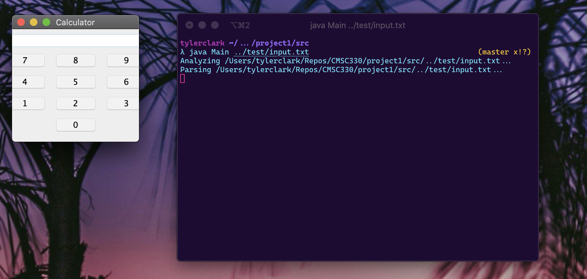
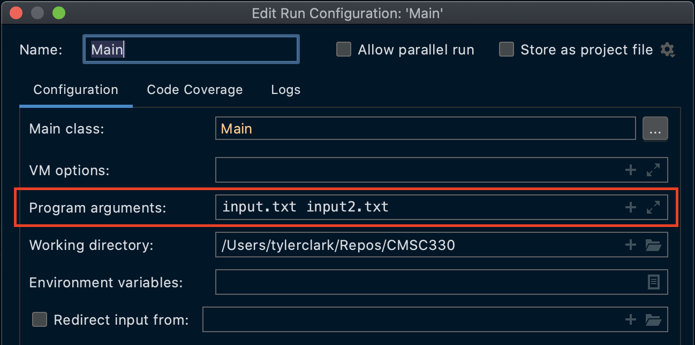
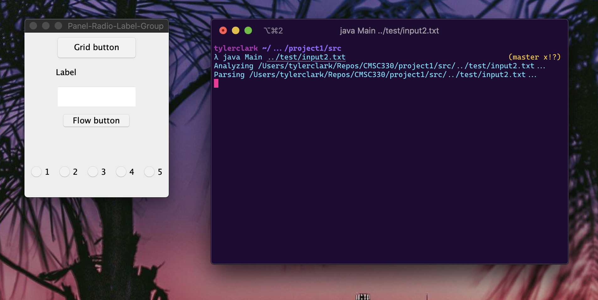

# Project 1 - Recursive Descent GUI Parser

**Author:** Tyler D Clark  
**Date:** 15 September 2020

[I got a 95%  with this. Feedback was that passing input file as a parameter of the main() method is not a good practice. 🤷🏽‍♂️]

**Description** A program that reads and parses a GUI definition language from text files. The program uses recursive descent to parse the language before building and creating the GUIs. This program uses command-line arguments to to pass the name of the input files to the program.
___

## File Layout

``` bash
project1
|
|____test
| |____input2.txt
| |____input3.txt
| |____input.txt
|
|____doc
| |____project1.md
| |----project1.pdf (You are here!)
|
|____src
| |____Parser.java
| |____LexicalAnalyzer.java
| |____Main.java
| |____FileHandler.java
| |____Token.java
| |____SyntaxError.java

```

## Project UML


## Running the Program

This program can be ran via command-line by entering the src directory and compiling all java files:

```bash
cd project1/src
javac *.java
```

Then, run main with java and pass the input file:

```bash
java Main ../test/input.txt
```



or pass multiple files to test:

```bash
java Main ../test/input.txt ../test/input2.txt
```

**Note:** If running from an IDE, can pass command-line arguments to main, like so:



## Test Cases

Test case will check all of the following:

* Window generation
* Flow layout
* Grid layout
* Button Widgets
* Group Widgets
* Radio Button Widgets
* Label Widgets
* Panel Widgets
* TextField Widgets
* Nested Panels
* Syntax Error Detection

### Case #1

Testing the provided input file.

``` txt
Window "Calculator" (200, 200) Layout Flow:
Textfield 20;
Panel Layout Grid(4, 3, 5, 5):
Button "7";
Button "8";
Button "9";
Button "4";
Button "5";
Button "6";
Button "1";
Button "2";
Button "3";
Label "";
Button "0";
End;
End.
```

Screenshot (same as above):


This test cases confirms that Windows can ge be generated, but also that Panels, Grid layout, Flow layout, Textfield and Buttons are working correctly.

### Case #2

Testing nested panels, Radio widgets, Label widgets, and Group widgets.

``` txt
Window "Panel-Radio-Label-Group" (230, 285) Layout Flow:
Panel Layout Grid(5,1):
Button "Grid button";
Label "Label";
Textfield 10;
Panel Layout Flow:
Button "Flow button";
End;
End;
Panel Layout Flow:
Panel Layout Grid(1, 5, 5, 5):
Group
Radio "1" ;
Radio "2" ;
Radio "3";
Radio "4" ;
Radio "5" ;
End;
End;
End;
End.
```



### Case #3

This test case will test for errors. It is the included grammar with an added error.

``` txt
Window "Calculator" (200, 200) Layout Flow;
Textfield 20;
Panel Layout Grid(4, 3, 5, 5):
Button "7";
Button "8";
Button "9";
Button "4";
Button "5";
Button "6";
Button "1";
Button "2";
Button "3";
Label "";
Button "0";
End;
End.
```

**Note** the semi-colon after Flow instead of the correct colon.


## Lessons learned / Conclusion

This project helped solidify the reading on Recursive Descent Parsers for me. I really see the need for having a individual production parser return a boolean after consuming a token. I think that was the most important aspect for the success of this program. I scratched my head at a very long time about nesting panels, parsing layouts and widgets. Using a container as a argument was also very important.

In the future, I would not waste as much time on the FileHandler.java file. I spent a lot of time making sure the program could accept multiple input files with differing paths.

All in all, this was good practice and very fun.
