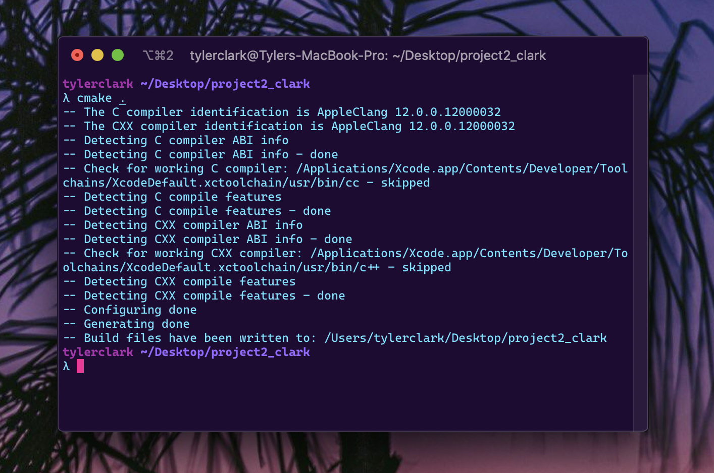
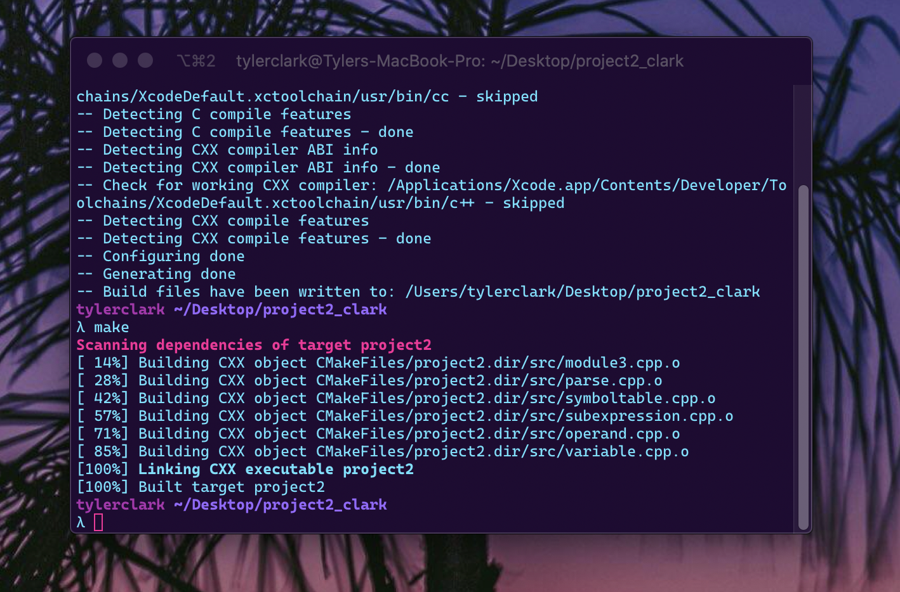
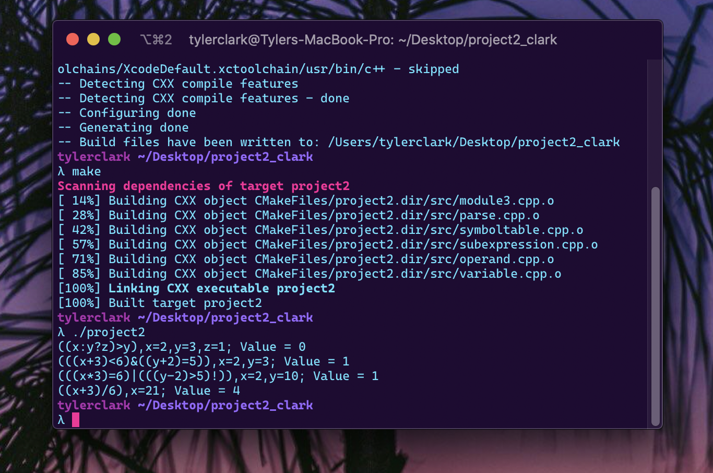

# Project 2 - Expression evaluator

**Author:** Tyler D Clark  
**Date:** 12 October 2020

**Description** This assignment is completing and extending a C++ program that evaluates statements of an expression language. The program reads in the arithmetic expression from a file and encodes the expression as a binary tree. After the expression has been read in, the variable assignments are read in and the variables and their values of the variables are placed into the symbol table. Finally the expression is evaluated recursively.
___

## File Layout

``` bash
project2
|
|____CMakeLists.txt
|
|____include
| |____and.h
| |____lessthan.h
| |____divide.h
| |____times.h
| |____negate.h
| |____subexpression.h
| |____parse.h
| |____operand.h
| |____literal.h
| |____variable.h
| |____symboltable.h
| |____equalto.h
| |____expression.h
| |____plus.h
| |____or.h
| |____minus.h
| |____greaterthan.h
| |____conditional.h
|
|____input.txt
|
|____doc
| |____project2.md
| |____img
| |____Project2_instructions.pdf
|
|____src
| |____subexpression.cpp
| |____parse.cpp
| |____module3.cpp (main is here)
| |____symboltable.cpp
| |____variable.cpp
| |____operand.cpp

```

## Running the Program

To run this program, it can be done from an IDE or using the command-line and CMake. The following instructions show running it in the command-line. The first step is to enter the project 2 folder and enter the command:

``` bash
cmake .
```



then the command:

``` bash
make
```



Lastly, the program can be run with the command:

```bash
./project2
```



## Test Cases

The following test cases will cover all of the operators included in the program. Since the file can read multiple inputs, all of the expressions to be evaluated will be in a single file ```"input.txt"```.

### Test case #1

```((x:y?z)>y),x=2,y=3,z=1;```

with this expression we can check off two operations:

- [ ] and
- [x] conditional
- [ ] divide
- [ ] equal to
- [x] greater than
- [ ] less than
- [ ] minus
- [ ] negate
- [ ] or
- [ ] plus
- [ ] times

The value return is the correct value of 0 (false), so it passes.

### Test case #2

```(((x+3)<6)&((y+2)=5)),x=2,y=3;```

This expression can check off even more operators:

- [x] and
- [x] conditional
- [ ] divide
- [x] equal to
- [x] greater than
- [x] less than
- [ ] minus
- [ ] negate
- [ ] or
- [x] plus
- [ ] times

The value return is the correct value of 1 since both sides of the & operator evaluate to true, so it passes.

### Test case #3

```(((x*3)=6)|(((y-2)>5)!)),x=2,y=10;```

This expression can check off three more operators:

- [x] and
- [x] conditional
- [ ] divide
- [x] equal to
- [x] greater than
- [x] less than
- [x] minus
- [x] negate
- [x] or
- [x] plus
- [x] times

Because the left side of the or operator is true, we get the correct return value of 1. The left side is made false by negate operation.

### Test case #4

```((x+3)/6),x=21;```

This expression will take care of the last operator, divide:

- [x] and
- [x] conditional
- [x] divide
- [x] equal to
- [x] greater than
- [x] less than
- [x] minus
- [x] negate
- [x] or
- [x] plus
- [x] times

After evaluating, we see we get the correct value of 4, so this last test passes as well.

## Lessons learned / Conclusion

Through this program, I learned a lot when it came to multi-file C++ projects and a bit on file-handling with C++. The separation of specification and implementation makes much more sense after completing this project and having multiple header files in use. The project instructions stated to assume all input will be correct, yet I did spend some time between IDE and command-line trying to make sure the input file would be read. Perhaps it was due to me being a novice at CMake, but I had to include the line in module3.cpp:

``` C++
std::ifstream file("../input.txt"); //works in IDE
if (!file)
{
    file = std::ifstream("input.txt"); //works in command-line
}
```

To ensure the file would be read with the ide or command-line. This had to do with where the output executable would be placed. Each time I ran the project in CLion IDE, it created a folder for the CMake output.

Overall,  I learned a great deal and enjoyed the project! I look forward to more opportunities to use C++!
