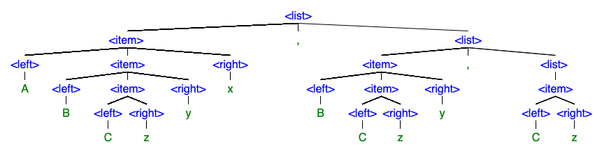

# Creating Parse Trees

**To verify that a string of characters belongs to a language defined by a grammar, we must create a parse tree that shows that the string can be generated by the grammar.**

**Consider the following grammar:**

``` html
<list> -> <item> , <list> | <item>
<item> -> <left> <item> <right> | <left> <right>
<left> -> A| B | C 
<right> -> x | y | z
```

**Choose a string that is in this language and create a parse tree that demonstrates that your claim is true. Identify another string that contains some of these terminals symbols but is not in the language.**

## My response

Based on the grammar, ABCzxy, BCzy, Cz could be a potential string with the following parse tree:



I think there could be infinite permutations of strings not in the language. But as an example, the following string uses terminal symbols from the language but does not adhere to the grammar:

**AAA, BB, C**

The reason this could not be from this language is because each <item> requires a ```<right>``` to be present in addition to the ```<left>```.

For the above parse tree, I used the website: http://mshang.ca/syntree/ with the following code:

``` html
[<list>
    [<item>
        [<left> A]
        [<item>
            [<left> B]
            [<item>
                [<left> C]
                [<right> z]
            ]
            [<right> y]
        ]
        [<right> x]
    ]
    ,
    [<list>
        [<item>
            [<left> B]
            [<item>
                [<left> C]
                [<right> z]
            ]
            [<right> y]
        ]
        ,
        [<list>
            [<item>
                [<left> C]
                [<right> z]
            ]
        ]
    ]
]
```

## follow up questions

### prompt

Thanks, Tyler.

Related questions :  how such trees will be used by a compiler  ?

What would be included in the first pass of most compilers of a fully compiled language? 

Class,

Welcome to share.

### answer

Professor,

The trees are used by the compiler to check for correctness. They make sure the input "fits" into the defined grammar rules. Further, later it is used to generate immediate code. That immediate code is what is included in the first pass of most fully compiled languages.

-Tyler C.

### other prompt

Thanks you, Eric.

Eric and Class,

 A general question:

 there are two basic approaches to parsing : top-down and bottom-up.

How do they differ? Which one  is most common and why ? Your thoughts?

### other answer

Professor,

To answer your question:

According to our Formal Syntax and Semantics module, top-down has the benefit of being simple and easy to understand, but suffers when it comes to left-recursion and arithmetic expressions. Bottom-up parsing, like [yacc](http://dinosaur.compilertools.net/yacc/) are more powerful, efficient, and accept more grammars but are much less intuitive. As a result, bottom-up tends to be more prevalent.