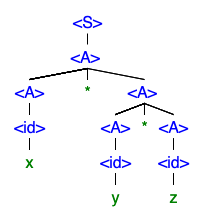
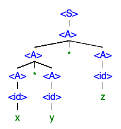

# Grammar Restrictions for Recursive Descent Parsers

**The first is that the grammar cannot have any left recursive productions. Give an example of a left recursive production and explain why such productions would be a problem.**

The recursive descent parser tries to replace the first non-terminal until it reaches a terminal symbol. Because of the left to right nature, a left recursive production would cause infinite recursion resulting in stack overflow. So if we were parsing a mathematical expression:

```<exp> --> <exp> <op> <exp>```

The parser would continually call the expression function until the stack space had been depleted. Further, indirect recursion would not be allowed. So the following production would lead to infinite recursion as well.

```<exp> --> <term> + <term>```

```<term> --> <exp> * <exp>```

The second restriction is that the grammar must not require more than one token look ahead. Give an example of a production that does not have this property. Explain why this restriction is necessary for recursive descent parsing.

One token look ahead basically means that every right hand side must begin with a different token. This is because the parser would not be able to differentiate based on that first token. This is also known as the pairwise disjoint test. As an example of a production that does not pass the test:

```<var> --> <id> | <id> <exp>```

But this can be refactored using EBNF, namely the ( )* which indicates zero or more options enclosed in the parentheses. So:

```<var> --> <id> (<exp>)*```

Or it can be factored by introducing a new nonterminal:

```<var> --> <id> <varExp>```

```<varExp> --> "" | <exp>```

I just used a blank string to indicate nothing, but one could also use the epsilon symbol.

## follow up questions

### prompt

Thank you, Brandon.

A related question :

how to prove  that the following grammar is ambiguous ? Could you come with at least two  trees that meet  that grammar ?

```<S> → <A>```

```<A> → <A> * <A> | <id>```

```<id> → x | y | z```

Class – welcome to join.

### response

Professor,

A grammar is said to be ambiguous if the sentential form has two or more trees. So for this string: "x * y * z" you could get this tree:



or this one:


