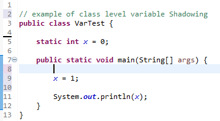
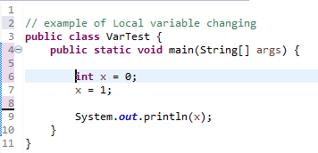

# Week 3 Discussion

I have all the code below in a REPL if you're interested in running it -> https://repl.it/@Tylerdclark/ScopingRules

**Give examples in Java to illustrate a case where declaring two local variables with the same name in same method is permitted and one where it is prohibited.**

``` java
public class ScopeRules {

    private static String example(boolean onlyOne) {
        // by using a conditional statement, another scope can be made
        if (onlyOne) {
            String highlander = "There can be only one";
            return highlander; // if we didn't return here, scope would change
        }

        String highlander = "Another time, McCloud";
        return highlander;
    }

    private static String badExample() {
        String highlander = "There can be only one";

        // Uncommenting below will cause an error!
        // String highlander = "Well I guess you're right";

        return highlander;
    }


    public static void main(String[] args) {

        System.out.println(example(true)); // prints "There can be only one"
        System.out.println(example(false)); // prints "Another time, McCloud"
        System.out.println(badExample()); // prints "There can be only one"
    }
}
```

**Are the rules governing redeclaration of local names the same as those governing redeclaring local names that rename class-level names?**

The rules differ when redeclaring local names that rename class-level names. What happens is that the scope changes when the local variable is created and it "shadows" the class-level variable. Therefore, you lose access to the class-level variable. For instance:

```java
public class ScopeRules {

    static String shadow = "Shadow me!"; //class level

    public static void main(String[] args) {

        String shadow = "I'm shadowing";

        System.out.println(shadow); //prints "I'm shadowing"
    }
```

**One consequence of scope rules in most languages is that forward references (referring to names before they are declared) are prohibited. Are such forward references always prohibited within a single Java class? Are forward references of local names always prohibited within a single method? If not, provide an example that demonstrates your claim.**

This question reminds of "hoisting" in JavaScripts with the var identifier. For those who don't know, in JS when you use the "var" keyword to create variables, it "hoists" the variable declaration to the top of the page at the beginning of compilation. This can cause undesired effects and is generally not recommended. It's one of the reasons why everyone is using the "let" and "const" keywords now. Anyways, with java, forward referencing is not entirely disallowed. Within a class, it is possible to uses trick the compiler into letting it happen. I hope I can explain with an example.

```java
public class ScopeRules {

    public static class forwardRef {
        String one = "you comp" + methodOne();
        String two = "you comp" + methodTwo();
        String three = "osed an error.";

        String methodOne() {
            return "lete me."; // this is fine
        };

        String methodTwo() {
            return three; // forward reference??
        };
    }

    public static void main(String[] args) {

        forwardRef ref = new forwardRef();
        System.out.println(ref.one); //prints "you complete me."
        System.out.println(ref.two); //prints "you compnull"
    }
}
```

In the above example, we get null returned by methodTwo() because we are forward referencing the String variable, three, which only has it's default value of null.

## Follow-up questions

### Prompt

Clark,

you make a good point with the description to the class level variable, i still dont see how that would be any different than declaring a variable then changing it. bellow are two images of what i mean. in both cases the output would be the same





Anyway let me know what you think!

-Brandyn 

### Response

Hey Brandyn,

Thanks for the reply! So, many of the times when I have used static variables, I used them so that they could be "shared" by all of the (static) methods and static classes. I have always thought of static as "belongs to this class".  So for instance, I might use static for a counter which counts the total creation of objects in the class. I'll try to show with an example.

``` java
public class StaticExample {

    static int counter = 0;

    static class ObjA {
        ObjA() {
            counter++;
            // otherCounter++ can't access it!
        }
    }

    static class ObjB {
        ObjB() {
            counter++;
            // otherCounter++ can't access it!
        }
    }

    public static void main(String[] args) {
        int otherCounter = 0; // can only access this within his method!

        ObjA objectOne = new ObjA();
        ObjB objectTwo = new ObjB();

        System.out.println(otherCounter); // prints 0
        System.out.println(counter); // prints 2
    }

}
```

Hopefully you get the idea for the static identifier. It definitely has its uses! It is shared within the class and that's why they call them class variables. Local variables like your second example only have the scope of the curly braces they are called in. Let me know if that cleared that up or just made more questions.

-Tyler C.

### Another prompt

Dear Class,

When responding to the  Discussion Question above, it could be worthwhile  to look at the  differences  of Java scope rules from the ones of the C language.   What are  those differences and what are the reasons that Java developers have changed them as compared with C?

Please share .

### Another response

I believe that the C rules to scoping are a little harder to understand and that might be why Java developers decided to change them. I will try to explain with an example.

``` C
#include <stdio.h>

int programScope; // variable declared outside of function has global scope
static int fileScope; // use of static outside of function gives file scope

int main()
{
    int blockScope = 1; // block scope / local variable
    {
        int blockScope = 2; // different block scope, shadows other
        printf("%d\n" ,blockScope);// prints 2
    }
    printf("%d\n" ,blockScope); //prints 1
    return 0;
}
```

So, there are similar rules to local variables and shadowing as you can see with the example. By using the static scope and declaring outside of function, we can create a variable that is visible throughout the file. By just declaring without static, it has "global" access and can be accessed by other files as well. The above are some C rules on scoping, but there is also the topic of storage classes. Briefly:

Block scope variables have temporary "auto" duration
Static variables have permanent duration that persist after their functions have exited
using the extern identifier creates a global variable with permanent duration
"register" keyword allows block scope with quick register storage
There is a lot more that goes into storage classes such as the individual declarations, storage location, default values and lifetime but that is outside the scope (haha) of this post.
