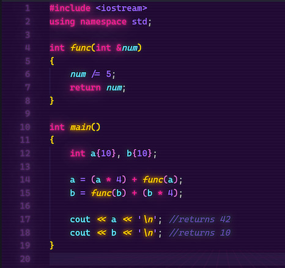
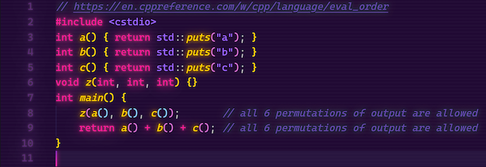

# Week 4 discussion

Give an example in C++ of an expression whose value depends upon the evaluation order. Show the orders that produce different values and the values they produce. Explain what side effect is the expression contains.

Example:



In my example, two variables are first initialized to 10 before having their values recalculated. In this recalculation is where the evaluation order affects the result.

On line 14, the sub-expression (a *4) is first executed, returning 40. It is then followed by the function call func(a), which assigns the value 2 to variable a. 40 + 2 gives the a variable a final value of 42.

On line 15, different ordering of the previous expression provides different results. This time, func(b) is called first, which changes b's value to 2. Then the second sub-expression is executed (2 *4), so the final calculation is 2 + 8 = 10. The value is different from the previous because b's value is changed in the function call and this is the side effect.

It is important to note that C++ does not always execute left to right, but in my example it happened consequentially by the fact that the subexpressions are being added. Whenever I am in doubt of operator preference, I check this [cppreference](https://en.cppreference.com/w/cpp/language/operator_precedence) page.

Another interesting related topic is [evaluation order](https://en.cppreference.com/w/cpp/language/eval_order), which explains that there is no left-to-right or right-to-left evaluation in C++. From the example on that page:



When compiled with g++ results in:

```bash
c
b
a
a
b
c
```

But with clang, results in:

```bash
a
b
c
a
b
c
```

## Follow-up questions

### Prompt

Dear Class,

Prior to answering the DQ on code samples, it could be worthwhile to clarify what  the term 'side effect' formally means in C++, and what is its significance. How do you define a side effect in C++ ?

Please share. 

### My response

According to the C++ standard:

*"Accessing an object designated by a volatile glvalue (3.10), modifying an object, calling a library I/O function, or calling a function that does any of those operations are all side effects, which are changes in the state of the execution environment."*

So basically expressions that modify the program state and/or perform I/O as they are being evaluated create side effects. This becomes an important topic when talking about "pure functions" which disallow side effects, which i'm sure we'll get to.
Side effects have a huge role when the optimizer of the compiler works between sequence points. Now, there is a lot that goes into where sequence points are placed, but essentially all side effects in a sequence point are to occur before the introduction of related steps in another sequence point. With C++, the optimizer has the freedom to rearrange operations between those sequence points and that is where the undefined behavior comes from!
