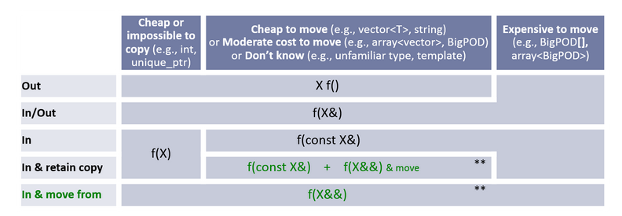

# Week 5 discussion

## Initial question

One characteristic of programming languages that varies widely from language to language is how parameters are passed. Among ALGOL, Pascal, Ada, C, C++, Java, and C#, no two languages pass parameters in exactly the same way. Among these languages, choose the one that you believe has adopted the best approach to parameter passing. Defend your decision by outlining the advantages of the approach of the language that you chose and the disadvantages of the approaches taken by other languages.

## My response

After reading the module, I found that there are quite a few factors in parameter passing. Previously, I had only really known of passing by reference and passing by value which have been sufficient for me this far. From my usage, I think that C++ has the best parameter passing approach (likely biased). In the following sentences, I'll talk about how C++ handles parameter semantic roles.

Most of the time, passing by value is more than adequate for most usages and is the default measure in C++ (and only option in Java). But using values alone restricts to "in" operations only. Meaning we can only copy a value into a function. With pointers and references, however, we can perform out and in-out operations. 

It seems the most difficult part when it comes to parameter semantic roles, is ensuring you chose the most efficient one. But as a rule of thumb: for passing small objects, passing by value is preferred because the overhead of copying the value is less than the overhead needed to dereference, since dereferencing will result in more memory read. For bigger objects (for example a large structure), copying would be greater overhead than passing reference. So references would be the better choice there.

Now, all the difficulty of choosing can be alleviated by using Ada or C# which allow you to explicitly declare the parameter semantic roles and leave the optimization to the compiler. Personally, I would prefer to be in charge of the decision, so that I might have a better understanding of what is going on under the hood which would undoubtedly help with debugging.



I found this cool chart from this [page](https://www.modernescpp.com/index.php/c-core-guidelines-how-to-pass-function-parameters).

On the topic of parameters, I also like that C++ allows default parameters (Just like another preferred language of mine, Javascript). C++ also allows a certain level of type-checking with parameters by requiring a prototype to be present.

## Follow-ups

### Question

Tyler,

I have never really used C++ much; I have been programming in Java and Python mainly. I always heard that it is easy to create extremely insecure programs with C++. Does this have anything to do with the parameter passing and the flexibility one has with compiler optimization? 

Excellent write up by the way.

Brandon

### My response to it

Brandon,

Thank you! To kind of dance around your question: I have to say that I have very limited experience in C++ and it's also one of those languages that is not too hard to learn, but very hard to master. So, it is easy to write insecure (and further error-ridden) programs in C++. As i've stated, i'm no authority on it, but some common areas that cause issues are:

* Pointers and references - Java and python don't really mess around with these concepts too much and it can be easy to accidentally dereference a null pointer and crash your program.
* Accessing arrays outside of their bounds gives undefined behavior instead of the friendly ArrayIndexOutOfBounds Exception we know from Java.
* Using uninitialized variables also give undefined behavior!
  
And in general, memory management with C++ can be overwhelming. Between needing to allocate and free memory and the dreaded [Memory leaks](https://stackoverflow.com/questions/6261201/how-to-find-memory-leak-in-a-c-code-project/8417851#8417851)!

You mentioned parameter passing, which can actually be a source of undefined behavior since the order of execution is left to the compiler.

I hope I could answer your question adequately. Let me know if you have any more questions. I think there is a certain sense of pride in learning C++ since it has a history. Also if you want to write a really efficient program, C++ is the language for you (or Rust, now).

-Tyler C.

### Another question

One more subject  to touch : 

When discussing parameter passing, one often meets  a description of currying process or a curried function. What are those and how they work in different languages?

### Another response

Professor,

Currying is one of the topics which is definitely useful for functional programming. It is when you take a function with multiple arguments (more arity) and split them into functions that take one argument (less arity). I have used this concept before with Javascript since it really works seamlessly with closures. I can give an example to at least clear up what it looks like.

(I hope using Javascript is ok)

```javascript
function curryAdd(outerParam) {

    return (middleParam) => {

        return (innerParam) => {

            return outerParam + middleParam + innerParam;

        }

    }

}

const result = curryAdd(10)(20)(30)

console.log(result); //prints 60
```

That's a bit of of nesting there, but I hope you can see what is happening. Instead of a function with 3 parameters, we have a nested function for every additional param. When passing values as parameters, we could just pass one value at a time, and we would get returned a function that expects more parameters until they are all fulfilled. To get result, I simply chained 3 functions calls to curryAdd, but it could also be done with separate calls and subsequent assignments. Like:

```javascript
const res1 = curryAdd(1);

const res2 = res1(2);

const res3 = res2(3);

console.log(res3); // prints 6
```
