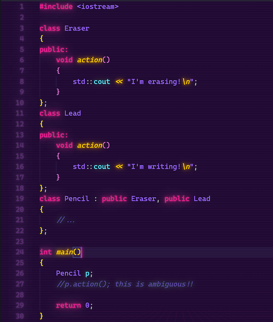
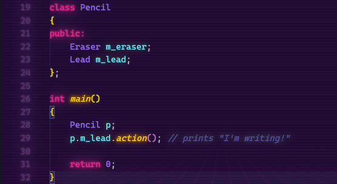
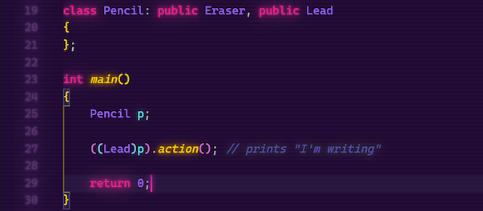
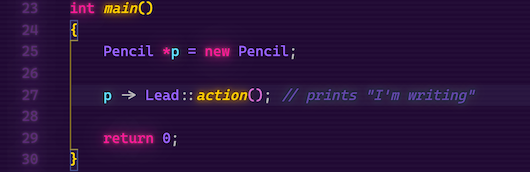
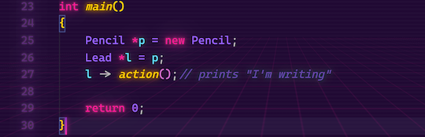

# Week 7 discussion

## Initial question

Among object-oriented languages, one feature that varies considerably is whether the language allows multiple inheritance. C++ does but Ada does not. Java takes a middle ground approach of allowing multiple inheritance of interfaces but not classes. Using a C++ example, illustrate some of the complexities that multiple inheritance introduces. How does C++ deal with them? Why does Java's middle ground approach offer some of the benefits of multiple inheritance while avoids its problems.

## My post

Some think multiple inheritance is a bad design element, and there are unique scenarios where it might seem prudent. With C++, there are a couple of issues that you can run into with multiple inheritance.  For instance, when a class is inheriting from multiple classes and those classes have a same data member or method with the same signature, this introduces ambiguity to the compiler. For illustration, please consider the following example:

This would not compile if the commented line was uncommented. Now, there are several ways to tackle this problem. The first, could be changing from inheritance to composition:

But with this approach, we change the structure and lose polymorphism and dynamic binding. So depending on the application, it might be better to use another way (let the record state that I prefer composition). We can cast the child to the parent of which we are using the method:

or we can use the scope resolution operator to explicitly qualify it to the proper parent:

or implicitly qualify:

The previous examples show a few of the ways to tackle the ambiguity issue of multiple inheritance. Java avoids these issues altogether by only allowing multiple interfaces, which only contain abstract method. By using these interfaces, you will always be restricted to specify "what to do" vs "how to do it". The Java way is much safer and will save headaches from the dreaded "diamond problem" as well.

Python is another language that support multiple inheritance and in JavaScript you can hack it to work by creating a parent object as a combination of two parent prototypes.
